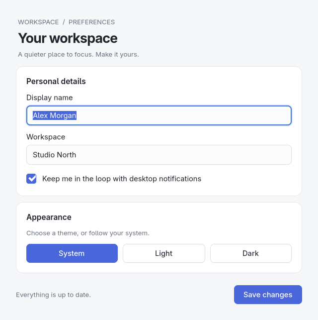
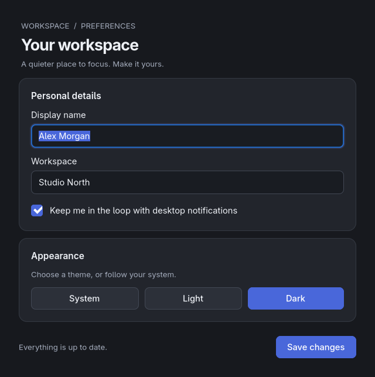
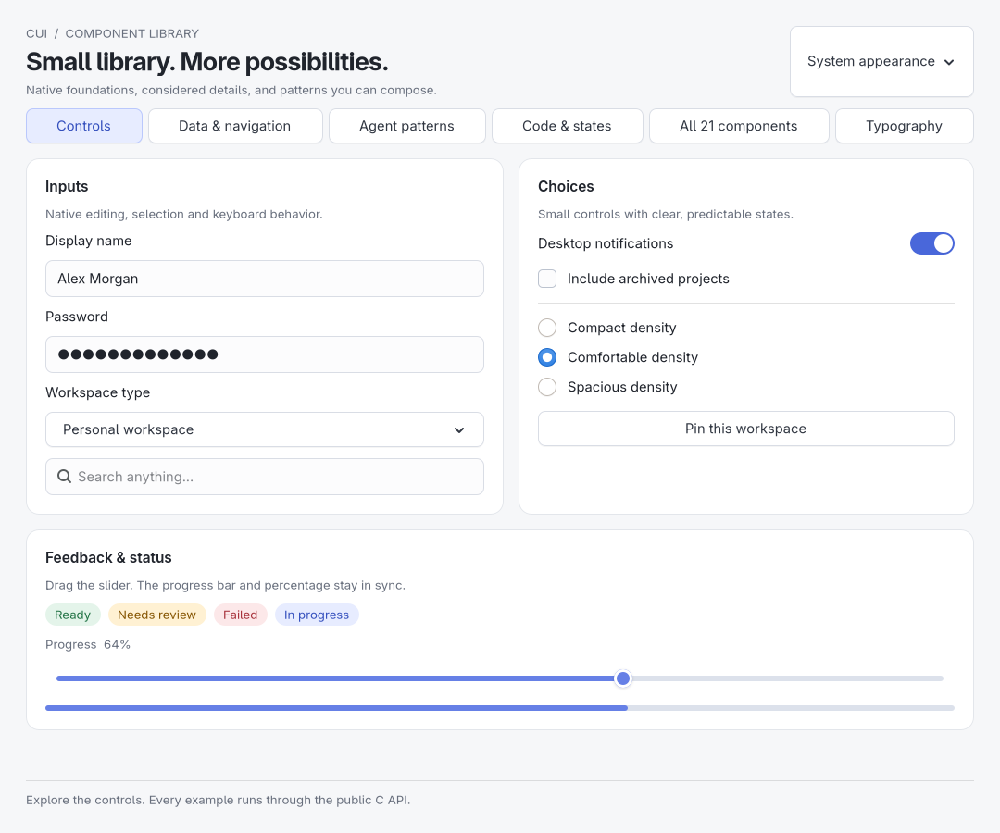

# CUI

A small C99 GUI framework with native controls, automatic layout, and a deliberate visual design. Applications use a C API; macOS has a private Objective-C implementation and Windows uses C++/WinRT internally. Windows builds restore pinned WinUI 3 dependencies; Linux uses GTK and macOS uses AppKit. No bundled fonts or browser UI.

**Early prototype, not production-ready.** Framework development, documentation and the showcase proceed together. Windows/macOS native verification is deferred to a later phase. Linux is compiled, tested, and visually inspected here. The Windows backend is being migrated to WinUI 3; its native build and visual checks and macOS compilation/runtime checks remain. The CI workflow builds all three; it has not been run remotely from this workspace.

## Appearance is part of the API

UI code describes semantic roles—title, heading, caption, primary action, card—rather than specifying identical pixels for every platform. Theme selection is `CUI_THEME_SYSTEM`, `CUI_THEME_LIGHT`, or `CUI_THEME_DARK`.

| Platform | Implementation | Appearance |
| --- | --- | --- |
| Linux | GTK 4 controls and boxes | Scoped application styles, rounded cards, focus states, relative typography, light/dark palettes; desktop settings portal for system appearance |
| Windows | WinUI 3 controls hosted in desktop XAML islands | Fluent buttons, inputs, menus and dialogs, system theme resources and native keyboard/accessibility support |
| macOS | AppKit controls | Aqua/Dark Aqua, system accent and semantic colors, native text fields/buttons, standard Edit menu |

The Windows backend uses **WinUI 3**, with the Windows App SDK 1.8 runtime as a deployment requirement. Win32 still handles the top-level window and operating-system integration; widgets use Fluent XAML controls. Mica/Acrylic window backdrops are not enabled by this change. Linux keeps its own style and macOS uses AppKit styling. Native Windows visual review is still required.

Actual Linux renders, captured from the settings example:

| Light | Dark |
| --- | --- |
|  |  |

## Build

Linux/macOS need CMake 3.16+, a C compiler, and the platform development SDK. Windows needs CMake 3.20+, Visual Studio 2022 C++ build tools, a current Windows SDK, and `nuget.exe` on PATH. The Windows build restores pinned NuGet packages.

**Linux:** GTK 4.6+ development files with X11 support and Xext and `pkg-config` are required (for example, `libgtk-4-dev libxext-dev` on Debian/Ubuntu or `gtk4-devel libXext-devel` on Fedora). The GTK runtime and its transitive libraries must be installed on the destination system. They are not bundled, and are not assumed to exist on every Linux installation.

```sh
cmake -S . -B build -DCMAKE_BUILD_TYPE=Release
cmake --build build --parallel
./build/cui_gallery
./build/cui_desktop_gallery
./build/cui_settings
# Optional startup overrides:
./build/cui_settings --dark
./build/cui_settings --light
```

**Windows:** Windows 10 1809 or later. Install the matching [Windows App SDK 1.8 runtime](https://learn.microsoft.com/en-us/windows/apps/windows-app-sdk/downloads) on the machine that runs the app. Use a Visual Studio developer terminal:

```powershell
cmake -S . -B build -G "Visual Studio 17 2022" -A x64 -DCUI_BUILD_TESTS=ON
cmake --build build --config Release
ctest --test-dir build -C Release --output-on-failure
.\build\Release\cui_settings.exe
```

Windows produces `cui.dll` and the `cui.lib` import library. Ship the DLL and `Microsoft.WindowsAppRuntime.Bootstrap.dll` alongside your executable, and install the Windows App Runtime and Visual C++ runtime. Static CUI archives and compiling the backend with MinGW are no longer supported on Windows. C, Python, Rust, Go and Zig still consume the same C ABI; see [packaging](docs/guides/packaging.md#windows).

**macOS:** Xcode command line tools, CMake, and the AppKit SDK (macOS 10.15+ API surface). The backend uses manual Objective-C reference counting internally:

```sh
cmake -S . -B build -DCMAKE_BUILD_TYPE=Release
cmake --build build --parallel
open build/cui_settings.app
```

The example's theme buttons work on every backend. “Save changes” only updates the demonstration state; it does not write preferences to disk.

## Use from C

```c
#include "cui.h"

static void clicked(cui_widget *sender, void *data)
{
    (void)sender;
    cui_set_text((cui_widget *)data, "Ready to go.");
}

int main(void)
{
    cui_app *app = cui_app_create();
    if (!app) return 1;
    cui_window *window = cui_window_create(app, "Hello", 480, 260);
    if (!window) { cui_app_destroy(app); return 1; }
    cui_widget *root = cui_window_root(window);
    cui_widget *title = cui_label(root, "A little more native.");
    cui_set_role(title, CUI_ROLE_TITLE);
    cui_widget *status = cui_label(root, "Built with CUI.");
    cui_widget *button = cui_button(root, "Get started");
    if (!title || !status || !button) { cui_app_destroy(app); return 1; }
    cui_set_role(button, CUI_ROLE_PRIMARY);
    cui_on_action(button, clicked, status);
    cui_window_show(window);
    cui_app_run(app);
    cui_app_destroy(app);
    return 0;
}
```

In another CMake project:

```cmake
add_subdirectory(path/to/cui)
target_link_libraries(my_app PRIVATE cui)
```

For Windows consumers, embed an application manifest with Common Controls v6 and PerMonitorV2 DPI awareness, as in `examples/windows.manifest` and `examples/windows.rc`. The example also shows a GUI-subsystem `WinMain` entry point. macOS consumers can use a normal C entry point and package their executable as an `.app`.

## Contract and scope

- One application, any number of windows; all API calls on the main thread.
- The application owns all widgets and windows. Closing hides a window and keeps its handles valid. Destroy the app after the event loop returns.
- UTF-8 strings and logical units. Windows handles per-monitor DPI changes and XAML text scaling; AppKit uses points; GTK manages device scaling and RTL box placement.
- Layout uses native content measurements, nested rows/columns, padding, and flexible space. Native minimums prevent controls from being squeezed below their contents. Scrollable windows preserve access to oversized content; grids, wrapping rows and resizable split panes are available in `cui_layouts.h`.
- Programmatic setters suppress callbacks. User edits, toggles, and clicks invoke them. Disabled parent boxes keep descendants disabled without discarding each child's own enabled state.
- Input fields following labels in the same box receive an accessible label on GTK/AppKit. Native controls provide baseline keyboard, selection, IME, and accessibility behavior; screen-reader and multilingual input audits remain necessary.
- GTK typography is relative to the user's base font. GTK HighContrast and Windows high-contrast settings use native/system colors instead of the normal custom palette.

The expanded control gallery includes tables, lists, switches, radio groups, multiline text, code, search, sliders, progress, badges, images, charts, tabs and disclosures. All **21 Beautiful UI families** have initial native compositions; [the coverage matrix](docs/components.md) states which interactions are implemented and which still require work. This is not full feature parity with the reference.

Go, Python, Zig and Rust have bindings and functional native examples: [installation and examples](docs/bindings.md). Python uses standard-library ctypes, Go uses cgo, and Zig calls the C ABI directly. Rust provides checked handles, owned results and closures over the complete raw ABI with no Cargo dependencies. Build tooling and installed platform libraries are required; no third-party language runtime packages are needed.

[High DPI and typography](docs/high-dpi.md) covers 4K, font inheritance, installed font families/weights, and independent text scaling. The gallery's **Type** tab demonstrates these controls.

The [desktop gallery](docs/desktop.md) adds native dialogs, command menus/toolbars and shortcuts, undo/redo, focus and accessibility labels, grids, wrapping containers, split panes, tree navigation, numeric steppers, date/time inputs, and validation fields. Go, Python, Zig and Rust expose these APIs.

Editable multiselect tables now provide stable sorting and source-row tracking through `cui_tables.h`. Remaining work includes lazy table data and richer cells, floating popovers/overlays, rich content, drag-and-drop, dynamic widget deletion, full RTL layout on Windows/macOS, and complete accessibility/reduced-motion coverage. [The completion plan](docs/completion-plan.md) tracks the wider requested scope. API/ABI stability is not promised yet.




## Validation and size

```sh
cmake -S . -B build -DCMAKE_BUILD_TYPE=Release -DCUI_BUILD_TESTS=ON
cmake --build build --parallel
ctest --test-dir build --output-on-failure
```

Linux GUI tests run automatically when `xvfb-run` is installed and the environment permits an X server. They exercise the real example and native controls: Unicode round trips, callback suppression/delivery, theme changes, high-contrast fallback, disabled-state inheritance, window close/reopen, and bounds at 1×, 2×, 4K, and enlarged text. Component tests exercise all 21 families. Optional binding tests run all three language examples through their native event loops. Layout tests run without a display on all platforms. Windows CI builds WinUI and runs a public C API smoke test covering controls, models, canvas, themes, focus and shutdown. Those checks still need to run on Windows; they do not replace visual/IME/accessibility testing. macOS CI provides compilation and layout tests.

A separate Clang build uses AddressSanitizer and UndefinedBehaviorSanitizer. GTK runs disable leak detection because toolkit process-global caches outlive the application; this does not establish leak freedom. Wayland, mixed-monitor/fractional scaling, native Windows/macOS behavior, and accessibility still need platform testing.

The current Linux x86-64 Release size measurements are recorded in [validation notes](docs/validation.md). Measurements exclude installed GTK and its transitive shared libraries. No runtime memory target has been established yet.

Public interfaces live in `include/`: core widgets, patterns, desktop actions, layouts, navigation, typed inputs, tables, search, tokens and feedback. Core ownership/layout lives in `src/cui.c` and `src/cui_layout.c`; primitive controls, compositions and reference patterns have separate source objects. A single platform backend is compiled. The C, Go, Python, Zig and Rust examples call the public API.


The desktop gallery includes native filtered multi-file/folder selection, color/font chooser actions, breadcrumbs linked to its tree, searchable commands, autocomplete, removable labels, banners, toast regions and empty/error recovery actions. Go, Python and Zig galleries also demonstrate searchable greetings, Undo notifications and token fields. See [desktop APIs](docs/desktop.md) and the [remaining completion work](docs/completion-plan.md); the full requested catalog is still in development.

## Documentation website and native showcase

Start with the language tutorials: [Python](docs/guides/python.md), [Go](docs/guides/go.md), [Zig](docs/guides/zig.md), and [Rust](docs/guides/rust.md). Each embeds a complete runnable example from the test suite.

The repository includes a dependency-free static documentation site: 69 component pages with real Linux captures, all 21 reference families, 22 guides, exact C API declarations, language examples and local search. Prototype behavior remains labeled. Build tooling requires Python 3.12+; the website itself uses only HTML, CSS and JavaScript.

```sh
cmake --build build --parallel
python3 tools/build_docs.py
python3 tools/check_docs.py
python3 -m http.server 8080 --directory build/docs
```

Open `http://localhost:8080`. Launch the corresponding native component with `./build/cui_showcase tokens`; use `--list` for every stable ID. See [the site maintenance guide](docs/site/README.md) for capture refreshes and coverage checks. Generated `catalog.json`, `api.json`, Markdown, `llms.txt` and `llms-full.txt` make the reference available to coding agents. No publishing service is required; `build/docs` can be served by any static host.

## Native app demos

Three offline mock apps show the bindings in realistic layouts. They have working local interactions and fictional data; no accounts, network requests or bundled dependencies. State resets on exit.

- **Relay / Go** — pinned/archived conversations, history search and paging, reactions, quoted replies, editing, sample attachment metadata and delayed simulated replies. After building CUI, run `cd bindings/go && go run -buildvcs=false ./cmd/messenger`. [Source](bindings/go/cmd/messenger/main.go).
- **Cadence / Python** — 12 tracks, editable playlists, a reorderable queue, history, favorites, shuffle/repeat, seeking and simulated playback. Build with `-DCUI_BUILD_SHARED=ON`, then run `PYTHONPATH=bindings/python python3 examples/python/music.py`. [Source](examples/python/music.py).
- **Postbox / Zig** — filtered folders, multi-selection, bulk moves with undo, saved/resumable drafts, reply/forward and validated local sending. Run `zig build -Dexample=mail run`. [Source](examples/zig/mail.zig).

The documentation homepage features all three; open `apps/index.html` on the generated site for native screenshots, interaction walkthroughs, source and setup instructions. The machine-readable `apps.json` exports the same app contracts. Linux interaction tests run at ordinary scale and 4K with 2× scaling and 150% text when `CUI_BUILD_BINDING_TESTS=ON`.

Icons support reusable vector and RGBA assets, imported SVG geometry, system PNG/JPEG loading, native button/toggle integration and Go/Python/Zig/Rust wrappers. See [the icon guide](docs/guides/icons.md).

## Development safety checks

Run `python3 tools/check_memory.py all` for Linux sanitizer/leak checks, static analysis, Valgrind and fuzzing. Read the [memory-safety guide](docs/guides/memory-safety.md) for prerequisites, retained diagnostics and known GTK findings. Instrumentation is development-only and adds no shipping dependency.

[Waypoint, the Rust simulator workspace](docs/plans/rust-simulator.md), now demonstrates custom drawing, group opacity and a translucent inspector. See the drawing guide for supported operations and native opacity limits.

### Custom drawing and Waypoint

The [drawing guide](docs/guides/drawing.md) covers canvas regions, premultiplied compositing, group opacity, clipping, native fonts, vector icons and app-owned backdrop blur. Run the [Rust simulator workspace](bindings/rust/examples/simulator.rs), or the small interactive drawing examples in [Python](examples/python/drawing.py), [Go](bindings/go/cmd/drawing/main.go) and [Zig](examples/zig/drawing.zig). All four bindings expose the public C API.
