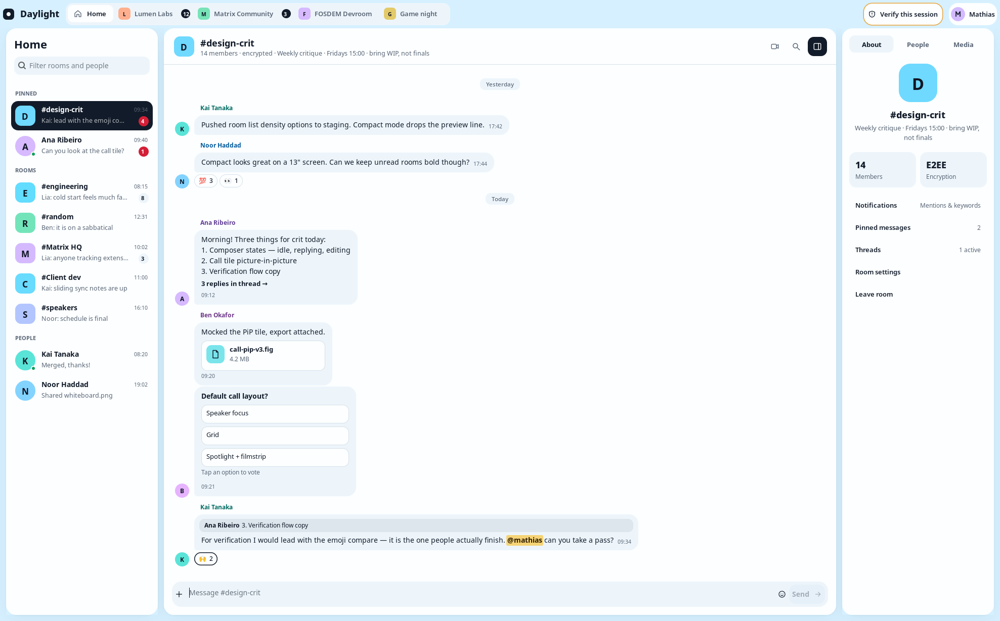
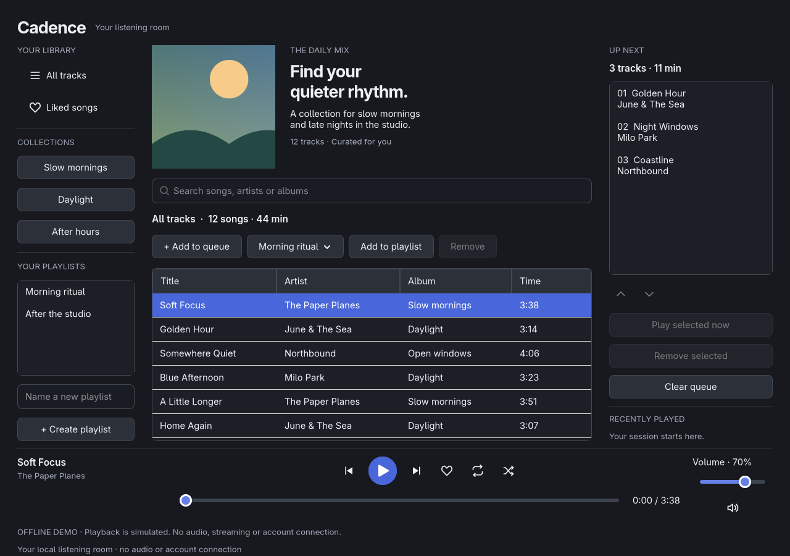
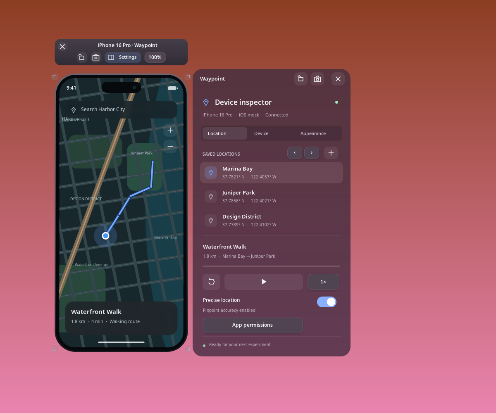

<p align="center">
  
</p>
<h1 align="center">CUI</h1>
<p align="center">Native desktop interfaces. A C API. Your language of choice.</p>
<p align="center">
  <a href="docs/guides/getting-started.md">C</a> ·
  <a href="docs/guides/rust.md">Rust</a> ·
  <a href="docs/guides/python.md">Python</a> ·
  <a href="docs/guides/go.md">Go</a> ·
  <a href="docs/guides/zig.md">Zig</a>
</p>

## Overview

CUI is a C99 GUI framework for Linux, macOS, and Windows. Build desktop apps with
native controls, flexible layouts, and custom drawing through one shared C API.
Use C directly or the Rust, Python, Go, and Zig bindings.

- **Native foundations:** GTK 4 on Linux, AppKit on macOS, and WinUI 3 on Windows.
- **Everyday controls:** buttons, text fields, lists, editable tables, trees, tabs, and more.
- **Flexible layouts:** rows, columns, grids, wrapping containers, and resizable split panes.
- **Desktop essentials:** menus, keyboard shortcuts, dialogs, and window management.
- **Room for your own design:** semantic typography, system/light/dark themes, icons, and canvas drawing.
- **Reusable chat UI:** conversation lists, message timelines, composers, threads, and reactions.

CUI powers [Archaic](https://github.com/merl111/archaic), a native Matrix client written in Rust.

**CUI is an early prototype.** APIs and ABI may change, and capabilities vary by
platform. See the [component guide](docs/components.md) for current support.

## A look inside

### Native controls


### Light and dark

| Light | Dark |
| --- | --- |
|  |  |

### Conversation interfaces



[Explore the chat components](docs/guides/chat.md).

### App layouts in Python



[Browse the Cadence example](examples/python/music.py).

### Custom drawing in Rust



[Explore custom drawing](docs/guides/drawing.md) or [browse Waypoint](bindings/rust/examples/simulator.rs).

*These are native Linux captures. Demo apps use sample data and simulated services;
CUI provides the interface, while your application supplies networking, storage, and media.*

## Get started

Clone the repository, then build the library and examples:

```sh
git clone https://github.com/merl111/cui.git
cd cui
```

### Linux

Install a C compiler, CMake 3.16+, pkg-config, GTK 4.6+ development files with X11
support, and Xext development files. On Debian/Ubuntu, the library packages are
`libgtk-4-dev` and `libxext-dev`.

```sh
cmake -S . -B build -DCMAKE_BUILD_TYPE=Release
cmake --build build --parallel
./build/cui_settings
```

### macOS

Install the Xcode command line tools and CMake 3.16+. CUI uses AppKit APIs available
in macOS 10.15 and later.

```sh
cmake -S . -B build -DCMAKE_BUILD_TYPE=Release
cmake --build build --parallel
open build/cui_settings.app
```

### Windows

Use Windows 10 1809 or later, Visual Studio 2022 with C++ build tools, a current
Windows SDK, CMake 3.20+, and `nuget.exe` on PATH. Install the
[Windows App SDK 1.8 runtime](https://learn.microsoft.com/en-us/windows/apps/windows-app-sdk/downloads),
then run these commands in a Visual Studio developer terminal:

```powershell
cmake -S . -B build -G "Visual Studio 17 2022" -A x64
cmake --build build --config Release
.\build\Release\cui_settings.exe
```

For application integration and runtime dependencies, see the
[packaging guide](docs/guides/packaging.md).

## Build your app

Start with a complete example in your preferred language:

[C](docs/guides/getting-started.md) · [Rust](docs/guides/rust.md) ·
[Python](docs/guides/python.md) · [Go](docs/guides/go.md) · [Zig](docs/guides/zig.md)

Then explore [controls](docs/components.md), [layout and styling](docs/guides/styling.md),
[desktop integration](docs/desktop.md), [drawing](docs/guides/drawing.md),
[icons](docs/guides/icons.md), and [chat](docs/guides/chat.md).
The [ownership guide](docs/guides/ownership.md) explains the main-thread API and application lifecycle.
