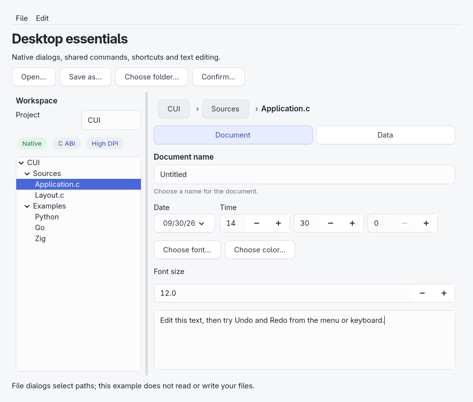
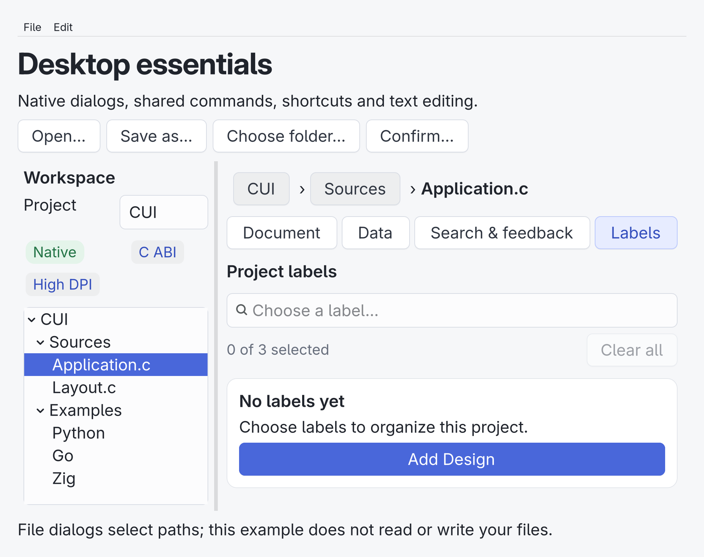
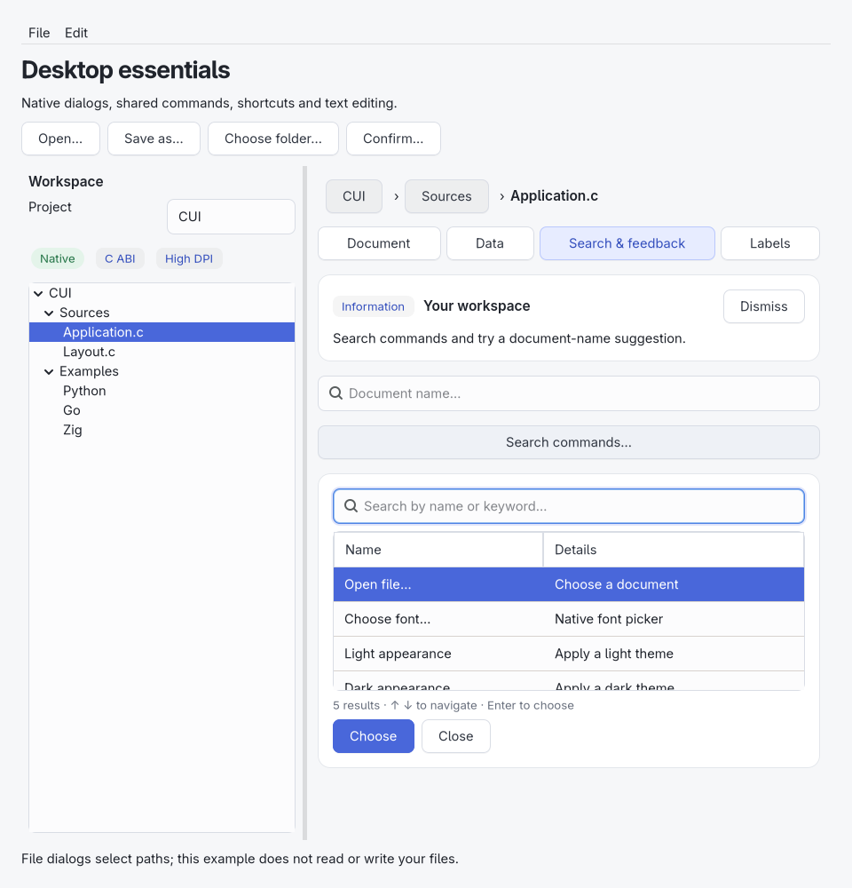

# Desktop controls

Build and run `cui_desktop_gallery` for native menus, dialogs, keyboard shortcuts, a split workspace, hierarchical navigation and a validated editor form. The example selects file paths; it does not read or write user files. Changing the numeric font size updates the editor.

All handles follow the main-thread, app-owned lifetime contract in `cui.h`. Strings and tree models are copied; dialog result paths are valid only during the callback. Closing a window hides it. App destruction releases the owned models and cancels pending dialogs without delivering callbacks.

| Header | Features |
| --- | --- |
| `cui_desktop.h` | Focus, accessibility names/help, read-only text inputs, undo/redo, alerts, open/save/folder dialogs, commands, menus, context menus and toolbars |
| `cui_layouts.h` | Grid spans, wrapping rows, horizontal/vertical split panes |
| `cui_navigation.h` | Native hierarchical trees with stable IDs and selection/expansion/activation events |
| `cui_tables.h` | Editable, multiselect tables with stable text/numeric sorting and source-row tracking |
| `cui_inputs.h` | Numeric steppers, date/time pickers, labeled fields and inline validation |

## Layout and tree example

```c
#include "cui_layouts.h"
#include "cui_navigation.h"

cui_widget *split = cui_split(root, CUI_HORIZONTAL, 0.3);
const cui_tree_item nodes[] = {
    {1, 0, "Project", 1},
    {2, 1, "Sources", 1},
    {3, 2, "main.c", 0},
    {4, 1, "README.md", 0}
};
cui_widget *tree = cui_tree(cui_split_pane(split, 0), nodes, 4);
cui_expand(tree, 1);
cui_textarea(cui_split_pane(split, 1), "Start editing…");
cui_tree_select(tree, 3);
```

Tree parents precede children. IDs must be unique, nonzero 64-bit values; parent 0 means a root. Replacing a model clears selection. Selecting a hidden descendant expands its ancestors. Programmatic collapse moves a descendant selection onto the collapsed branch. Read the event type and ID with `cui_tree_last_event`. Setters never invoke the user callback.

The GTK tree uses `GtkTreeListModel`, `GtkListView` and `GtkTreeExpander`; Windows uses a tree-view control; macOS uses `NSOutlineView`. GTK creates row widgets as they are needed. The shared model still stores all supplied text in memory; this is not a lazy filesystem/data provider. Limits are 65,536 items and 128 levels.

Grids allow at most 64 columns and 256 rows. `cui_grid_cell` creates a box at a nonoverlapping span. Ordinary children appended to a grid occupy its first free cell. Split panes contain exactly two owned boxes, and their divider respects minimum content dimensions.

## Commands and dialogs

Commands share enabled/checked state between menus, toolbar buttons and shortcuts. `CUI_MOD_PRIMARY` means Command on macOS and Control elsewhere. Use named submenus at the top level of a menu bar. macOS preserves application and standard editing commands alongside custom menus.

Dialog creation defers opening until the UI loop runs. Cancelling a dialog that is already open can invoke its callback before cancellation returns. Each dialog completes at most once. The original file-dialog constructor selects one local path. The extended constructor supports copied file filters and multiple selection; see “File filters and multiple selection” below. Non-filesystem portal resources remain outside the local-path API.

## Input values and validation

Numeric inputs support finite bounds up to ±1e9 and 0–9 decimal places. Bounds and increment must be representable at that precision. Programmatic values are rounded and clamped; invalid typed text returns to the previous committed value. User typing commits on Enter/focus loss, and stepper arrows commit immediately.

Dates are Gregorian civil values in years 1601–9999, with leap-year validation. Times use hours 0–23 and minutes/seconds 0–59. Neither carries a timezone or denotes an instant. GTK supplies a calendar popover and a three-part time control; Windows and AppKit use native date/time controls.

`cui_field` combines a label, entry, help and error text. Its callback receives edits from the entry; applications implement business validation and call `cui_field_set_error`. An empty error clears invalid state. Errors are visible and included in the input's accessible description; GTK also exposes the native invalid state. Listen on the field wrapper to preserve internal event forwarding.

## Verification boundaries

Linux native tests cover actual tree selection/expansion/activation, a 10,000-row model, dialog completion/cancellation, shortcuts, command state, editing, grid spans, splitters, numeric commits and validation, and date/time changes. The language examples run their native event loops. Windows is cross-compiled and linked; native interaction and appearance need a Windows host. macOS source needs compilation and runtime verification on a macOS host. These controls do not establish complete accessibility coverage or completion of the full component plan.

## Editable tables

`cui_table_set_multiple` enables native extended selection. Query all selected rows with `cui_table_selected_rows`; the original `cui_get_selected` returns the first selected row. `cui_set_selected` replaces the entire selection even in multiple mode.

Enable editing per column with `cui_table_set_editable`. GTK uses native editable labels, Windows overlays a native Unicode edit control, and AppKit uses editable table cells. Enter commits and Escape cancels on GTK/Windows; AppKit uses its standard cell editing behavior. Windows F2/Enter starts editing the first editable column of the selected row; double-click targets a particular cell. Programmatic cell updates are available independently of user-editability.

`cui_table_sort` sorts one column stably, either by UTF-8 byte order or finite numeric value. Numeric sorting puts invalid/non-numeric cells last. Sorting and data replacement clear selection. `cui_table_source_row` preserves the input row index from the most recent `cui_table_set_rows`, so applications can map edited display rows back to their own records. The records/filter/diff compositions retain user cell edits in their copied source data when filtering again.

Native header clicks sort text on Windows, macOS and GTK 4.10+. The older GTK 4.6–4.8 baseline supports the same programmatic sorting API without clickable sort headings. GTK uses virtualized column rows, Windows uses an owner-data list view, and AppKit requests table values through its data source. The library still keeps all strings in memory; lazy external data providers are not implemented. Row updates and sorting are synchronous UI-thread operations.

## Color and font selection

`cui_color_dialog` opens the platform color chooser for an opaque sRGB `0xRRGGBB` value. `cui_font_dialog` opens the installed-font chooser; `cui_font_value` contains a copied UTF-8 family, point size, weight and italic flag. Initial values are copied. Opening is deferred, cancellation delivers one completion, and application destruction suppresses callbacks. Picker callbacks receive an empty path: call `cui_dialog_color` or `cui_dialog_font` to retrieve an accepted value. Those getters leave output unchanged on cancellation or failure. `cui_font_apply` applies the complete choice to a widget and its descendants, respecting the application's text scale.

Font families are limited to 128 UTF-8 bytes, sizes to 6–200 points, and weights to 100–900. Unsupported native selections report `CUI_DIALOG_FAILED`. Color alpha, font features/variation axes, underline and strikeout are not represented by these APIs. macOS uses its shared system panels with explicit Choose/Cancel controls; opening a second CUI picker of the same kind cancels the preceding one. An already-visible panel belonging to the host application is not taken over. GTK resolves family aliases and italic/oblique fallback to an installed face before initializing the chooser.

```c
static void font_chosen(cui_dialog *dialog, cui_dialog_result result,
                        const char *path, void *editor) {
    cui_font_value font;
    (void)path;
    if (result == CUI_DIALOG_ACCEPTED && cui_dialog_font(dialog, &font))
        cui_font_apply(editor, &font);
}
/* In an application action: */
cui_font_value initial = {"Sans", 12, 400, 0};
cui_font_dialog(window, "Document font", &initial, font_chosen, editor);
```

GTK uses the GTK 4 native choosers; Windows uses the installed common dialogs (`comdlg32`); macOS uses AppKit's color/font panels. No font files or chooser dependencies are bundled. Windows runtime appearance and all macOS native checks remain outstanding.

## Breadcrumbs and searchable sidebars

`cui_breadcrumbs` accepts an ordered array of `{id, text}` segments. Ancestors are native buttons with keyboard focus; the current location is a label. Paths wrap, support copied model replacement and stable IDs, and allow up to 128 segments. Listen on the root and read `cui_breadcrumbs_activated`; update the path after application navigation. The C desktop example connects breadcrumbs to its native tree in both directions. Repeated replacements reuse existing native controls.

The `CUI_SIDEBAR` composition now contains a native tree in its BODY part. Set its source through `cui_sidebar_set_items(sidebar, tree_items, optional_details, count)`. Names and details participate in search. Results retain their ancestor paths and open them; clearing search restores saved expansion state. Replacing/filtering the model clears selection. Selection emits SELECT, activation emits OPEN, and expansion/filter changes emit CHANGE on the composition root. Query IDs with the tree APIs on the BODY part. Do not replace the BODY callback or model: that bypasses the composition's source management.

For compatibility, `cui_pattern_set_records` can still populate a Sidebar with flat nodes using IDs `1..row_count`. Sidebar BODY is now a tree rather than a list; use `cui_tree_selected` instead of positional list selection. Search uses the platform Unicode normalization shared by autocomplete. Icon rows and a dedicated screen-reader audit remain outstanding.



## Search, command palettes and token fields

Include `cui_search.h` for `cui_picker`. `CUI_AUTOCOMPLETE` keeps its search input visible; `CUI_COMMAND_PALETTE` starts hidden and opens with `cui_picker_open(picker, return_focus)`. Both expand inside the application's layout. They are not floating popovers or modal command windows.

A copied `cui_choice` model supplies unique nonzero 64-bit IDs, labels, details, keywords and disabled state. Up/Down skip disabled choices, Enter accepts, Escape closes, and Tab accepts an autocomplete suggestion before ordinary focus traversal. Active input-method composition retains its navigation keys. Losing focus closes results without stealing focus from the newly selected control. Search matches labels, details and keywords using platform Unicode case handling; exact matching across unusual case-folding/normalization combinations may differ by OS. Results use the native virtualized table, with a 65,536-choice limit. Keyboard navigation scrolls the highlighted row into view while retaining input focus. Selection identifies the original choice even after sorting results.

Listen on the picker root for `QUERY`, `SELECT`, `SUBMIT` or `CANCEL`. Accepted choices have a stable ID; unmatched autocomplete text produces `SUBMIT` with ID 0 for application validation. Programmatic model/query/selection setters and close are silent; `cui_picker_accept` performs the user action. Internal part handles are for sizing/styling/inspection: replacing their action/key handlers breaks event forwarding.

Include `cui_tokens.h` for ordered multiple selection. A token field combines the same search model with wrapping native removal buttons, a count and a Clear all action. Choose a limit from 1 to 128. Selected choices disappear from suggestions, duplicates and disabled choices are rejected, and Backspace on empty input removes the last token. Removing a focused token restores focus to the input. Replacing the model preserves selected IDs that remain present and enabled. Removal buttons are reused; repeated updates do not accumulate controls.

`cui_tokens_set_selected` replaces selection silently and rejects invalid input without changing selection. `cui_tokens_add`, `remove` and `clear` emit typed events and report whether a change occurred. Unmatched input emits `SUBMIT`; the application may validate it, add a choice with its own ID, and select it. The library does not invent IDs or silently create new choices.

## Feedback regions

Include `cui_feedback.h` for banners, in-app toasts, empty states and error states. Construct a region once, then call `cui_feedback_show` to replace its copied title/message/action and semantic tone. Regions start hidden. Empty/error states offer an optional action; banners/toasts also offer dismissal. These are layout regions, not OS notifications or floating overlays.

Only toasts accept expiry durations; 0 means persistent. Countdown pauses while explicitly paused, hidden through an ancestor, disabled, hovered, or focused through a descendant. Re-showing resets the clock and reuses its timer. Action does not dismiss automatically. User action, dismissal and timeout emit separate root events; programmatic show/dismiss/pause are silent. A callback may show the same region again, including from its timeout callback. GTK 4.14+ and AppKit use native accessibility announcements; older GTK uses accessible text and Windows emits an accessibility notification. Screen-reader verification still requires native hosts.

`cui_timer_start` restarts a stopped app-owned timer; calling it on a running timer is harmless. `cui_on_key` exposes navigation keys on entry/search/password and list/table controls. Return true to consume the key. Modifiers use `CUI_MOD_*`; Control also sets `PRIMARY` on Windows/Linux. Remove the handler with NULL. Text changes continue to use the ordinary action callback.

The C desktop gallery's **Search & feedback** and **Labels** tabs demonstrate actual selection, theme commands, file/font dialog commands, label validation, notifications and recovery actions.





## File filters and multiple selection

`cui_file_dialog_ex` extends the original file-dialog constructor. Pass copied `cui_file_options` with an initial path, named extension filters, the initially selected filter index, and optional multiple selection. Open and folder dialogs support multiple selection; save dialogs accept one destination. Folder dialogs reject extension filters. NULL options uses the same defaults as the original API.

```c
static void selected_files(cui_dialog *dialog, cui_dialog_result result,
                           const char *first_path, void *data) {
    (void)first_path;
    (void)data;
    if (result != CUI_DIALOG_ACCEPTED) return;
    for (size_t i = 0; i < cui_dialog_path_count(dialog); ++i) {
        const char *path = cui_dialog_path(dialog, i);
        /* Application handles each selected path. */
        (void)path;
    }
}

static void choose_documents(cui_window *window) {
    const char *extensions[] = {"txt", "md"};
    const cui_file_filter filters[] = {
        {"Documents", extensions, 2}, {"All files", NULL, 0}
    };
    const cui_file_options options = {NULL, filters, 2, 0, 1};
    cui_file_dialog_ex(window, CUI_DIALOG_OPEN, "Choose documents",
                       &options, selected_files, NULL);
}
```

Filters use literal extensions (`txt`, `md`, `tar.gz`), without a leading dot or glob. Empty extension lists mean all files. Limits are 64 filters, 32 extensions per filter, 255 bytes per name and 64 ASCII letters/digits/dots/hyphens/underscores per extension. The native picker controls extension matching and save-extension behavior; a filename filter does not validate a file's content. Save examples supply a filename with its desired extension. The library selects paths; it does not write a destination or open the selected files.

The callback retains its original signature and receives the first path. `cui_dialog_path_count` and `cui_dialog_path` expose all accepted paths until app destruction, including from inside the callback. Before acceptance, after cancellation/failure, and for non-file dialogs the count is zero. An out-of-range path lookup returns NULL. `cui_dialog_filter` returns the zero-based accepted filter index and leaves its output unchanged when unavailable. Multiple paths follow the native chooser's ordering, not necessarily the user's click order. Invalid/nonlocal results or allocation failure fail the entire result instead of returning a partial list. The result limit is 65,536 paths.

Initial paths may name a directory or a file; a save dialog also accepts a suggested new name. Native save overwrite confirmation remains in use. Options and filters may be temporary stack values because construction copies them. Invalid options return NULL before any dialog or callback is scheduled. Closing, cancelling or destroying the app follows the existing dialog lifecycle.

GTK uses the system file chooser and its filter menu. Windows uses the Common Item Dialog and its multiple-selection result array. AppKit uses native open/save sheets, with a native file-type selector in the accessory area. No additional runtime libraries are introduced. Native Linux acceptance/cancellation tests cover Unicode paths, two files, two folders, changing filters, uppercase suffixes, retained results, and a save destination that remains unwritten.
