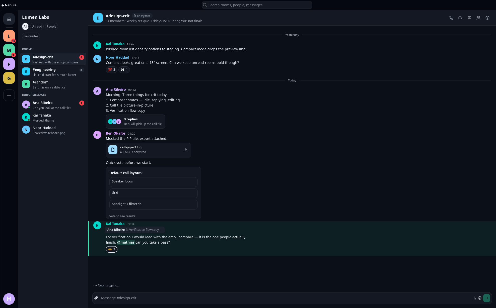
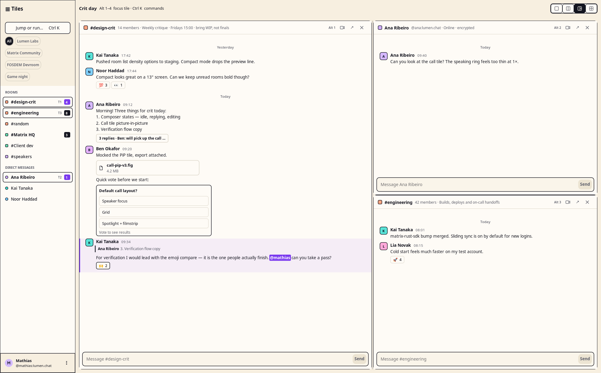

# Reusable desktop chat components

CUI implements chat rendering, copied models, interaction events, native composition and workspace state in **C**, behind `cui_chat.h`. Rust, Python, Go and Zig wrap that same implementation. The native concept example uses the reference HTML's local fixture data; Archaic supplies Matrix transport, storage, encryption and call media.

## Native previews

These captures show the C executable, not the HTML reference or a Rust rendering implementation. Visual parity is still in progress; they are not evidence of a measured 99% match.




[Engineering room](../images/chat/daylight-eng.png) · [Kai direct message](../images/chat/daylight-kai.png) · [Matrix HQ](../images/chat/daylight-mhq.png)



The [large-text capture](../images/chat/daylight-large.png) uses 150% body text and 2× display scale. [Capture provenance](../images/chat/provenance.json) records C implementation, fixture and screenshot hashes.

[Nebula thread](../images/chat/nebula-thread.png) · [Nebula call](../images/chat/nebula-call.png) · [Daylight verification](../images/chat/daylight-verification.png) · [People](../images/chat/daylight-people.png) · [Media](../images/chat/daylight-media.png) · [Tiles command palette](../images/chat/tiles-palette.png)

These additional captures exercise states beyond the initial screen. The thread is closed initially; activating the reply summary opens it in the same window. Room changes update the inspector and the open thread. The verification dialog blocks the underlying controls and supports acceptance, cancellation, outside click and Escape. Tiles supports Ctrl K, searchable room/command selection, Alt 1–4 pane focus, layouts and maximize/restore. The call panel is a local UI demonstration, not a media connection.

## Components and bindings

| Shared component | C kind |
| --- | --- |
| Grouped room navigation, query filtering, unread badges, timestamps and presence | `CUI_CHAT_ROOMS` |
| Rich timeline, grouped messages, date separators, reply previews, files, reactions, polls and thread links | `CUI_CHAT_TIMELINE` |
| Native multiline editor, reply/edit context, attachment state, keyboard send and cancellation | `CUI_CHAT_COMPOSER` |
| Persistent one-to-four-pane layout, focus, close and maximize/restore | `CUI_CHAT_WORKSPACE` |
| Room identity, subtitle and action buttons | `CUI_CHAT_HEADER` |
| Vertical space rail or horizontal tabs | `CUI_CHAT_SPACES` |
| About/People/Media tabs, room hero, fact cards and action rows | `CUI_CHAT_INSPECTOR` |
| Single message with the same grouping and content rendering as a timeline | `CUI_CHAT_MESSAGE` |
| File identity, metadata and activation | `CUI_CHAT_ATTACHMENT_CARD` |
| Reaction counts, selected state and activation | `CUI_CHAT_REACTION_STRIP` |
| Poll choices, vote counts, closed state and activation | `CUI_CHAT_POLL_CARD` |
| Quoted sender and message text | `CUI_CHAT_REPLY_PREVIEW` |
| Reply count, participant avatars and latest reply | `CUI_CHAT_THREAD_SUMMARY` |
| Initial avatar, presence dot and square/circular presentation | `CUI_CHAT_AVATAR` |

Each component has its own [catalog entry and native C recipe](../components/index.html#catalog-grid), including the smaller elements that can be used outside a chat timeline. Archaic is the first consumer; none of these components depends on Archaic or Matrix.

All fourteen kinds share `cui_chat_create(parent, kind, appearance)` and the same C model/event functions. Choose `CUI_CHAT_NEBULA`, `CUI_CHAT_DAYLIGHT` or `CUI_CHAT_TILES`. `cui_chat_theme_get` supplies the HTML designs' OKLCH-derived color tokens; `cui_chat_set_theme` accepts customized colors and body font size.

| Language | Binding entry point | Source |
| --- | --- | --- |
| C | `cui_chat_create` | [Public header](../../include/cui_chat.h) |
| Rust | `ChatComponent::create(parent, ChatKind, theme)`; typed `chat::Timeline`, `Composer`, `Navigation`, `Workspace` adapters | [FFI adapter](../../bindings/rust/src/chat_native.rs) |
| Python | `cui.chat.Chat(parent, kind, appearance)` | [Binding](../../bindings/python/cui/chat.py) |
| Go | `parent.Chat(kind, appearance)` returns `ChatComponent` | [Binding](../../bindings/go/chat.go) |
| Zig | `ui.Chat.init(parent, kind, appearance)` | [Binding](../../bindings/zig/cui.zig) |

The C implementation performs layout, painting, model copying, keyboard handling and pane state changes. Bindings marshal input and translate events; they do not reimplement the renderer.

## Presentation and application choices

See [Reuse & framework comparison](component-design.md) for the AppKit, SwiftUI, WinUI, Qt and GTK comparison, current toolkit gaps, and examples of independent layout and command configuration.

`cui_chat_presentation_preset/get` and `cui_chat_set_presentation` expose independent message, room-list, header and composer styles, space orientation, inspector layout, geometry and visible composer tools. Theme changes preserve these choices. `cui_chat_set_commands` replaces header buttons, message hover actions or inspector tabs with copied application commands and stable IDs. All bindings expose these functions. The C example’s Daylight profile button demonstrates user-selectable message and room density preferences. Components inherit the ancestor font family and invalidate measured text when it changes. Mention foreground and background colors are independently configurable.

## Same-window composition

The new [Layered stack](../components/stack.html) is a general C layout, available in Rust, Python, Go and Zig. It hosts ordinary controls in overlapping layers; it is not specific to chat. The example composes the verification dialog from labels, an emoji grid and buttons; the call panel from avatars, a grid and controls; and the palette from the existing searchable picker.

```c
cui_widget *stack = cui_stack(root);
cui_widget *content = cui_stack_layer(stack, CUI_LAYER_FILL, 0, 0, 0);
cui_widget *dialog = cui_stack_layer(stack, CUI_LAYER_CENTER, 520, 0, 16);
cui_label(dialog, "Review this action");
cui_button(dialog, "Continue");
cui_set_visible(dialog, 0);
```

Later layers appear above earlier ones. Applications choose when a layer is visible, disable underlying controls for modal interactions, and restore focus on dismissal. The stack itself supplies placement, not application policy. Preferred sizes must accommodate native control minimums. The Daylight application draws its card shadows in a canvas underneath the controls using the existing drawing API; it does not bake those shadows into the stack component. Modal backdrop blur remains outstanding.

`cui_set_icon_trailing` places an ordinary button's icon after its label. `cui_picker_set_chrome` independently controls result headings, status text and action buttons, preserving those choices across filtering and reopening. These APIs are also exposed by every binding. There is no Rust-only implementation.

## Using a timeline and composer

```c
#include "cui_chat.h"

cui_widget *timeline = cui_chat_create(root, CUI_CHAT_TIMELINE, CUI_CHAT_DAYLIGHT);
cui_widget *composer = cui_chat_create(root, CUI_CHAT_COMPOSER, CUI_CHAT_DAYLIGHT);
const cui_chat_span spans[] = {{"Hello from CUI", "", CUI_CHAT_BODY}};
const cui_chat_message messages[] = {{
    .id = 1, .author = "Ana Ribeiro", .time = "09:12",
    .spans = spans, .span_count = 1, .selected_option = -1
}};
cui_chat_set_messages(timeline, messages, 1);
cui_set_placeholder(cui_chat_part(composer, 0), "Message #design-crit");
```

Register `cui_on_action` on the component root and read `cui_chat_event_get` inside the callback. Copy borrowed event text if you retain it. Call `cui_chat_refresh` after allocation, scale or model changes; unchanged scenes are reused. All calls run on the application UI thread.

Model setters copy nested arrays and strings, including `thread_participants` (up to eight avatars). `author_color` lets applications specify sender ink independently from avatar color; zero uses an appearance default. Inputs can be released after a successful setter. Message and room IDs must be unique and nonzero; `selected_option = -1` means an unvoted poll. Handles and part widgets belong to their window. Do not overwrite internal part callbacks.

The composer leaves draft text in place when it emits `CUI_CHAT_SEND`; the application clears it after acceptance. Enter submits, Shift+Enter inserts a newline, and Escape cancels reply/edit or attachment context. Busy state blocks submission. Native IME composition is protected.

The timeline emits reply, thread, attachment, reaction, vote, link and more actions. Quick reactions carry the emoji in event text and `index = UINT32_MAX`; existing reaction buttons carry their model index. The application updates its own model and calls the setter after accepting changes. Daylight hides poll totals until a vote, places thread links inside incoming bubbles and omits the avatar/name on outgoing bubbles. Nebula's inline thread panel starts closed in the example.

The default inspector commands use tab IDs 1 About, 2 People, 3 Media. Applications can replace these commands and choose the content layout independently. The first room model is the hero. About uses the next two rows as fact cards and remaining rows as actions. People uses remaining rows as list entries, with symbol-bearing rows available for actions such as Invite people. Media renders `cui_chat_set_status` as an introductory caption and uses a configurable grid of labeled color tiles (`media_columns`, 1–8; the reference preset uses three). The example replaces that data when the tab or room changes. A room row with `CUI_CHAT_MINE` stays marked active alongside the selected row; the Rust `NavItem.active` field exposes this for workspaces with several visible rooms.

## Rust integration

The complete Daylight composition is also available as a runnable Rust example.
It uses the same reference fixture and C widgets as the C example, including
space/room navigation, grouped messages, polls, reactions, drafts, inspector
tabs, threads, verification and same-window overlays. Application state and
event handling live in Rust; geometry, drawing and native controls stay in C.

```sh
cmake --build build-chat --target cui
CUI_LIB_DIR="$PWD/build-chat" cargo run --offline \
  --manifest-path bindings/rust/Cargo.toml --example daylight
```

[Rust Daylight preview](../images/chat/rust-daylight.png) ·
[Runnable entry point](../../bindings/rust/examples/daylight.rs) ·
[Application state](../../bindings/rust/examples/daylight/state.rs) ·
[Widget composition](../../bindings/rust/examples/daylight/ui.rs)

This is the integration starting point for Archaic. Replace fixture loading
with Matrix models and connect application actions to services. The example
does not establish a verified Matrix session or initiate real calls.
The older `chat_components` example remains a general component-contract demo.

`tools/check_chat_rust_parity.py` compares eight C/Rust states at identical
dimensions and requires at least 99.99% identical pixels, allowing the animated
text caret. [Recorded port comparison](../images/chat/rust-parity.json). This comparison verifies the language port; it is **not** a claim
of 99% parity with the HTML references. The fixtures are generated from one
JSON source with `tools/generate_chat_rust_fixture.py --check` detecting drift.

Use the same component factory for entire panes and small reusable elements:

```rust
use cui::{ChatComponent, ChatKind};
use cui::chat::{Appearance, Theme, Message, Reaction};

let theme = Theme::new(Appearance::Daylight);
let reactions = ChatComponent::create(&root, ChatKind::ReactionStrip, &theme)?;
reactions.messages(&[Message {
    id: 42,
    reactions: vec![Reaction { key: "🙌".into(), count: 2, mine: true }],
    ..Message::default()
}])?;
reactions.refresh(window.scale()?)?;
// Read reactions.drain() from the UI loop and update application state.
```

For Daylight, compose `Spaces`, `Rooms`, `Header`, `Timeline`, `Composer` and `Inspector` through the factory or the typed timeline/composer/navigation wrappers. `ThreadSummary.participants` is marshaled to C, as is `Message.author_color`. The C renderer owns bubble layout, color glyph painting, hit regions and appearance differences. Rust owns Matrix data and reacts to C events.

Rebuild libcui and the Rust crate together after public C model changes. `tools/generate_rust_bindings.py --check`, `tools/check_rust_abi.py`, and `tools/check_bindings.py` check generated declarations, actual C/Rust layouts and every language's API coverage. Native contract tests additionally exercise nested model copies and events in Rust, Python, Go and Zig.

## Run and capture

```sh
cmake -S . -B build-chat -DCUI_BUILD_SHARED=ON
cmake --build build-chat --target cui_chat_concepts
./build-chat/cui_chat_concepts daylight
./build-chat/cui_chat_concepts nebula
./build-chat/cui_chat_concepts tiles
CUI_LIB_DIR="$PWD/build-chat" CARGO_TARGET_DIR="$PWD/build-chat/rust" \
  cargo build --offline --manifest-path bindings/rust/Cargo.toml --example daylight
xvfb-run -a -s '-screen 0 3400x2600x24' python3 tools/capture_chat.py
python3 tools/check_chat_rust_parity.py --write
```

[Complete C example](../../examples/chat/main.c) · [Reference fixture](../../examples/chat/fixture.json) · [Implementation notes](../plans/chat-design-components.md)

## Fidelity and platform limits

The component and fixture reconstruction is still being refined against the supplied screenshots. Remaining differences include typography, Tiles pane shadows, modal backdrop blur, native focus styling, palette grouping, call-control artwork and some panel geometry. The shared text rasterizer preserves color glyphs on GTK and AppKit; Windows currently retains its monochrome GDI fallback. The C example's call and verification buttons are not connected to a Matrix backend. A screenshot match has not been measured at 99%.

Linux/GTK receives native interaction tests and captures. Windows and macOS backend changes require execution on those systems before equivalent visual and input behavior can be claimed. Text wrapping uses native word metrics with UTF-8 boundaries; full grapheme-aware line breaking and bidirectional layout need further work. The application owns room drafts, pagination, permission checks and server state.
